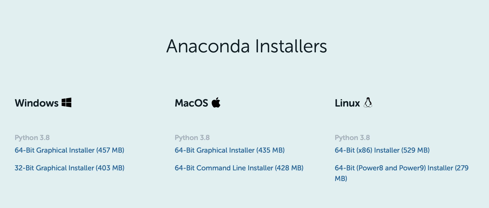
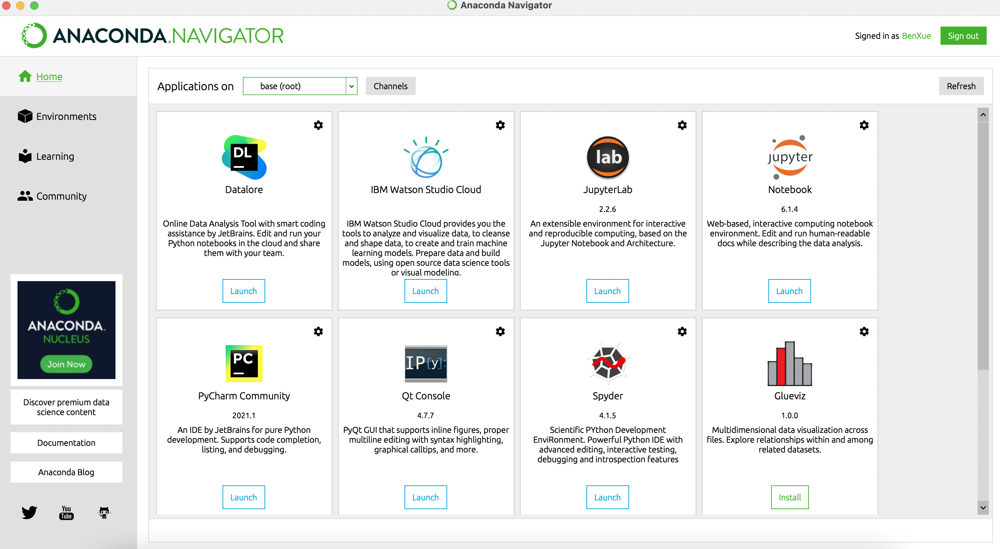

# Chapter 1 Getting Started

## 1.1 Software

### 1.1.1 Python Distribution: Anaconda

*Python* is a free and open source software. I recommend installing the *Python* distribution *Anaconda individual edition (also open source)* for purpose of this course. 

You can visit <https://www.anaconda.com>, go to the *Products* navigatio menu and then click *Individual Edition*. At the botton of this page, you can find the proper *Graphic* installer for your operating system. 

  
Once the installer is downloaded, follow the steps in the installation wizard to finish installing *Anaconda*.

### 1.1.2 Run Python in IDE (Integrated Development Environment): JupyterLab

At the *Windows Start Menu (Launchpad for Mac)*, select Anaconda Navigator

1. On Navigator’s Home tab, in the Applications pane on the right, scroll to the JupyterLab tile. Launch Jupyter Notebook by clicking Jupyter Notebook’s Launch button.

    This will launch a new browser window (or a new tab) showing the JupyterLab Dashboard.

2. Create a new *Notebook* with the Python version you installed (version 3).

3. Rename your Notebook by right-clicking the file on the left side bar. You can name it to whatever you’d like, but for this example we’ll use test.

4. In the first line of the Notebook, type or copy/paste

    `print("Hello World").`
    
    Run your new program by clicking the Run button or selecting Cell - Run All from the top menu.

5. Jupyter nodebood will autosave, but you can save it manually by using <kbd>CTRL</kbd>+<kbd>S</kbd> (or <kbd>⌘ Command</kbd>+<kbd>S</kbd> for mac).

    

../../../_images/getting-started_Jupyter.png
Close Jupyter Notebook
From Jupyter Notebooks top menu bar, select File - Close and Halt.
Click the Quit button at the upper right of the Notebook Dashboard and close the window or tab.
Close Navigator
From Navigator’s top menu bar, select Anaconda Navigator - Quit Anaconda-Navigator.